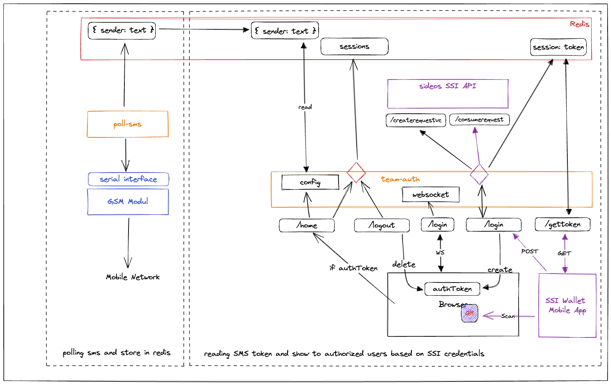

# SMS Hub for delegated authentication for your team using sideos
This repo is about getting rid of SMS one time passwords (OTP) and make them available through a web-based dashboard. For authentication you use a Passwordless Login with the sideos Wallet. It is using the new SSI Technology to store credentials on a phone for login to a web service. SSI stands for Self-Sovereign-Identity and is all about decentralized data in a web3 world. The example is using [sideos](https://sideos.io) for an easy start with SSI. 

The idea came up when the team was forced to use 2-Factor authentication for all kind of web applications and more then 1 person needs access to the account. Because it is not worth to create and pay another user license for just having a backup in place we wanted to have a secure fallback solution. For some reasons many web application provider just force to 2FA and don't think about the impact for a business user.

See "SMS OTP Hub für Teams" at [Raspi Lab](https://raspilab.org/computer-und-internet/sms-otp-hub-fuer-teams/#more-1875) for more information how to build the SMS Hub with a Raspberry Pi and a GSM hat. 



# Installation
The code is [typescript](https://www.typescriptlang.org/) so you need [node.js](https://nodejs.org/en/) installed on the Raspberry Pi. As a package manager we recommend [yarn](https://yarnpkg.com/). Also, we are using [Redis](https://redis.io/) as session store. Because of the decentralized nature of SSI we don't need a database to store user data. The credential used for the login also includes the data we need for our purpose. 

## Install the Code
Getting the repository:
`git clone git@github.com:rheikvaneyck/team-auth.git`

Change to the new folder and install the npm packages:
```
cd team-auth
yarn install
touch .env 
```

Edit the `.env` file to add the environment variables (we will set the values later)
```
ACCESS_TOKEN=<API token>
SSI_SERVER='https://juno.sideos.io'
LOGIN_TEMPLATE_ID=<template id>
CALLBACK_URL=<server url>
DID_ISSUER=<did>
```
The values for the variables ACCESS_TOKEN, SSI_SERVER, LOGIN_TEMPLATE_ID, and DID_ISSUER are set based on information from the sideos account as describefd below. 

The CALLBACK_URL variable is poiting to the url of the service and is shown once you've started the server, e.g. as `Server started at http://pi3p:9000`.

## Get an sideos Account
Go to [sideos onboarding](https://juno.sideos.io/plan-onboarding/1) and: 
1. download the sideos app
2. create an account at the console by following the instructions

## Create Login Credentials
For SSI login you need to create verifiable credentials which will be stored on the users phone. sideos is providing a template system which allows admins to create credentials for any possible use case. Templates are based of Credential Data Sets which combine one ore more Proofs. :
1. In _Proofs_, add a new proof. Give it a Name, create a new Type, e.g. 'email', and a Context, which is in the case of a simple string 'DataFeedItem'.
2. In _Credentials_, create a new template. Create a new _Credential type_, e.g. 'User' and give it a Name. Chose the proof which is the one we just created. 
3. Note down the _ID_ of the template we just created. This number goes into the `.env` file mentioned above as LOGIN_TEMPLATE_ID variable. 
4. In _Settings_, go to _Company Settings_ and set the _Token_ which goes into the `.env` file mentioned above as ACCESS_TOKEN variable. The value for the DID_ISSUER comes from the _Company DID_. 

Put the variables up in the `.env` file.

## Get the Verifiable Credentials
The credentials can be created by an API call and send in different ways to the user. The easiest way is just to click the button 'Test credentials' in the details of a template. It creates a credential which you can store on the phone and for the login later. For the SSI credential part: That's it. 

## Install and run Redis
The session data is stored in [Redis](https://redis.io/). For development purposes we don't secure redis and assume it is only running locally, so we don't care about exposing sensitive data to evil part of the world. Have a look at the Redis documentation to secure your configuration. To install Redis on a Raspberry Pi do:
```
sudo apt update
sudo apt get install redis
sudo systemctl start redis
```

# Run it
Start the dev service:
`yarn start:dev`

Open the server url shown in the console in your browser, in our case `http://pi3p:9000`:
```
pi@pi3a:~/team-auth $ yarn start:dev
yarn run v1.22.19
$ nodemon src/index.ts
[nodemon] 2.0.20
[nodemon] to restart at any time, enter `rs`
[nodemon] watching path(s): src/**/*
[nodemon] watching extensions: ts,json
[nodemon] starting `ts-node ./src/index.ts src/index.ts`
Server started at http://pi3a:9000
Redis Client connected...
Redis Client ready
``` 
